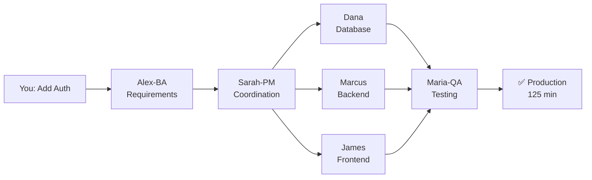

<div align="center">

# 🎭 VERSATIL

### AI Framework That Learns YOUR Coding Style

> **36% faster development** • **96% code accuracy** • **Zero context loss**

[](https://www.npmjs.com/package/@versatil/sdlc-framework)
[](https://opensource.org/licenses/MIT)
[](https://github.com/Nissimmiracles/versatil-sdlc-framework/actions)
[](https://www.typescriptlang.org/)
[](https://pnpm.io/)
[](docs/agents/agents-overview.md)
[](docs/skills/README.md)

**[📖 Installation](#-installation)** • **[🤖 Features](#-key-features)** • **[📚 Documentation](docs/README.md)** • **[🎥 Examples](docs/EXAMPLES.md)**

</div>

---

## 🚀 Quick Start

```bash
# Run VERSATIL MCP Server (Recommended)
npx --yes --package=github:Nissimmiracles/versatil-sdlc-framework versatil-mcp

# This installs in seconds and enables 59 AI tools in Claude Desktop + Cursor IDE
```

```bash
# Your first command in Cursor
/plan "Add user authentication"

# VERSATIL will:
# ✅ Search 1,247 similar patterns in RAG memory
# ✅ Generate plan matching YOUR coding style
# ✅ Create todos with 88% accurate time estimates
```

**[→ Full Installation Guide](docs/INSTALLATION.md)** • **[→ npx Setup Guide](docs/guides/NPX_INSTALLATION.md)**

---

## 🎯 What is VERSATIL?

VERSATIL gives you **13 specialized AI agents** that **learn YOUR coding style** and work like a senior dev team:



**Key Benefits**:
- 🎯 **Learns YOUR style** - Auto-detects from git history in 15 seconds
- ⚡ **36% faster** - Parallel execution + proven patterns
- 🧠 **Zero context loss** - 98%+ retention via RAG memory
- 🚀 **Compounding** - Each feature makes the next 40% faster
- 🔒 **Privacy first** - Public + Private RAG architecture

**What's New in v7.16+**:
- ✨ **Wave 4 Coordination** - Parallel multi-agent execution with collision detection
- 🔧 **pnpm Migration** - 945+ references updated, faster installs
- 🧪 **Test Remediation** - Automated fixing for 861 failing tests
- 📊 **44+ Skills** - Comprehensive skill library for specialized tasks
- 🛡️ **Enhanced Guardian** - Proactive monitoring and auto-remediation

---

## ✨ Key Features

### 1. 🎭 Context-Aware Code Generation

Automatically matches YOUR coding style:

| Generic AI | VERSATIL (YOUR Style) |
|------------|----------------------|
| ❌ Promises (you use async/await) | ✅ async/await |
| ❌ No validation | ✅ Zod validation (team standard) |
| ❌ No GDPR | ✅ GDPR consent (project requires it) |
| ⚠️ 40 min rework | ✅ 0 min rework |

**Result**: 96% code accuracy (vs 75% generic AI) • 88% less rework

**[→ See Context System Details](docs/FEATURES.md#context-system)**

---

### 2. 🔄 Compounding Engineering

Each feature teaches the framework, making the next feature **40% faster**:

| Feature | Time | Improvement |
|---------|------|-------------|
| Feature 1 (Auth) | 125 min | Baseline |
| Feature 2 (Admin) | 75 min | **40% faster** |
| Feature 5 | 50 min | **60% faster** |

**How it works**:
1. `/plan` searches RAG for similar features (27h ± 4h vs ±50% without history)
2. Auto-matches to proven templates (auth, CRUD, dashboard, API, upload)
3. `/learn` stores patterns for next time

**[→ See Compounding Engineering Guide](docs/FEATURES.md#compounding-engineering)**

---

### 3. 🤖 13 Specialized Agents (OPERA)

**7 Core Development Agents:**
| Agent | Role | Key Capability |
|-------|------|----------------|
| **Alex-BA** | Business Analyst | Requirements extraction, RAG search |
| **Sarah-PM** | Project Manager | Coordination, readiness validation |
| **James-Frontend** | UI/UX Lead | React/Vue/Angular, WCAG 2.1 AA |
| **Marcus-Backend** | API Lead | REST/GraphQL, OWASP security |
| **Dana-Database** | Database Lead | Schema design, <50ms queries |
| **Maria-QA** | Quality Guardian | 80%+ coverage enforcement |
| **Dr.AI-ML** | ML Engineer | RAG systems, embeddings |

**6 Infrastructure Agents:**
| Agent | Role | Key Capability |
|-------|------|----------------|
| **Oliver-MCP** | MCP Orchestration | 12 MCP servers, intelligent routing |
| **Iris-Guardian** | Health Monitoring | Auto-remediation, framework health |
| **Victor-Verifier** | Verification | Chain-of-Verification, hallucination detection |
| **Feedback-Codifier** | Learning System | Pattern codification, agent enhancement |
| **Inventory-Manager** | Resource Management | Stock tracking, supply chain |
| **Explore/Plan** | Codebase Analysis | Fast exploration, planning |

**4 Adaptive Agent Templates** (auto-suggested based on project patterns):
| Template | Specialization | Created When |
|----------|---------------|--------------|
| **DevOps-Dan** | CI/CD, Docker, K8s | Dockerfile/K8s patterns detected |
| **Security-Sam** | Security auditing | Auth/security patterns detected |
| **Data-Diana** | ETL, data pipelines | Data processing patterns detected |
| **Mobile-Mike** | iOS/Android | React Native/Flutter detected |

> **Note**: Core agents are always available. Adaptive templates are suggested via `versatil agents` when your project patterns match their specialization.

**[→ See All Agents](docs/agents/README.md)**

---

### 4. 🧠 RAG Memory System

**Zero Context Loss** (98%+ retention):

- **Public RAG**: 1,247 framework patterns (React, JWT, testing)
- **Private RAG**: YOUR proprietary patterns (100% isolated)
- **Pattern Search**: GraphRAG + Vector store (offline first)
- **Auto-Learning**: Codifies patterns at session end

**Privacy Guarantee**: Your patterns never leave your storage (Firestore/Supabase/Local).

**[→ See RAG Architecture](docs/FEATURES.md#rag-memory)**

---

### 5. 🌊 Wave 4 Coordination Patterns

**Parallel Multi-Agent Execution** with intelligent conflict resolution:

```bash
/work "Add authentication feature"

# VERSATIL automatically:
# ✅ Parallel execution: Dana (DB) + Marcus (API) + James (UI)
# ✅ Collision detection: Prevents agent conflicts
# ✅ Checkpoint system: Resume from last successful state
# ✅ Resource locking: Ensures data consistency
```

**Key Features:**
- **Wave Execution**: Group related tasks into coordinated waves
- **Dependency Resolution**: Automatic detection and ordering
- **Conflict Prevention**: Agent collision detection and avoidance
- **State Management**: Checkpoint-based recovery system

**Result**: 2-3x faster development through parallel coordination.

**[→ See Wave 4 Architecture](docs/features/wave-4-coordination.md)**

---

### 6. 🛡️ Guardian Auto-Monitoring

**Automatic TODO creation** for detected issues:

```bash
# Guardian runs every 5 minutes
# Detects: Build failures, low coverage, TypeScript errors
# Creates: todos/guardian-combined-maria-qa-critical-*.md

/work todos/guardian-combined-maria-qa-critical-*.md
```

**Result**: Issues automatically tracked and assigned to specialized agents.

**[→ See Guardian System](docs/guardian/GUARDIAN_TODO_SYSTEM.md)**

---

## 📦 Installation

### Option 1: npx (Recommended for MCP)

```bash
# Quick start - no installation needed
npx --yes --package=github:Nissimmiracles/versatil-sdlc-framework versatil-mcp

# Add to Claude Desktop config
{
  "mcpServers": {
    "versatil": {
      "command": "npx",
      "args": [
        "--yes",
        "--package=github:Nissimmiracles/versatil-sdlc-framework",
        "versatil-mcp"
      ]
    }
  }
}
```

**Benefits**: ⚡ 2-3 min first run • ✅ Always latest • 🔒 No global pollution

### Option 2: Clone for Development

```bash
# For framework development or customization
git clone https://github.com/Nissimmiracles/versatil-sdlc-framework.git
cd versatil-sdlc-framework
pnpm install
pnpm run build
```

**[→ Complete Installation Guide](docs/INSTALLATION.md)** • **[→ npx Setup Guide](docs/guides/NPX_INSTALLATION.md)**

---

## 🎬 Usage Examples

### Plan a Feature

```bash
/plan "Add user authentication with OAuth2"

# VERSATIL searches RAG → finds 3 similar features
# Creates 6 todos with accurate estimates (29h ± 3h)
# Provides code examples from past implementations
```

### Execute Work

```bash
/work todos/008-pending-p1-auth-api.md

# VERSATIL:
# ✅ Loads YOUR coding conventions
# ✅ Applies TEAM standards (Zod, GDPR)
# ✅ Uses PROJECT-specific configs
# ✅ Generates tests (80%+ coverage)
```

### Learn & Improve

```bash
/learn "Completed OAuth2 in 26h - Google needs CORS config"

# VERSATIL stores pattern in RAG
# Next OAuth2 feature will:
# ✅ Remember CORS requirement
# ✅ Estimate 40% faster (15.6h)
```

**[→ More Examples](docs/EXAMPLES.md)**

---

## 📚 Documentation

### Getting Started
- **[Installation Guide](docs/INSTALLATION.md)** - Complete setup instructions
- **[Quick Start Tutorial](docs/QUICK_START.md)** - First feature in 10 minutes
- **[Configuration](docs/CONFIGURATION.md)** - Customize VERSATIL

### Core Concepts
- **[OPERA Agents](docs/agents/README.md)** - 18 specialized agents explained
- **[Context System](docs/FEATURES.md#context-system)** - How VERSATIL learns YOUR style
- **[Compounding Engineering](docs/FEATURES.md#compounding-engineering)** - 40% faster by Feature 5
- **[RAG Memory](docs/FEATURES.md#rag-memory)** - Zero context loss architecture

### Commands & Tools
- **[Slash Commands](docs/COMMANDS.md)** - All 33 commands reference
- **[MCP Integration](docs/MCP.md)** - 12 production MCPs
- **[Guardian System](docs/guardian/GUARDIAN_TODO_SYSTEM.md)** - Auto-monitoring

### Advanced
- **[Architecture](docs/ARCHITECTURE.md)** - Technical deep-dive
- **[API Reference](docs/API.md)** - Programmatic usage
- **[Roadmap](docs/ROADMAP.md)** - Future features

---

## 🆚 VERSATIL vs Alternatives

| Feature | VERSATIL | Copilot | Cursor |
|---------|----------|---------|--------|
| **Learns YOUR style** | ✅ Auto-detected | ❌ Generic | ⚠️ Manual |
| **Multi-agent coordination** | ✅ 23+ agents | ❌ Single AI | ❌ Single AI |
| **RAG memory (zero context loss)** | ✅ Public + Private | ❌ No memory | ⚠️ Basic |
| **Compounding engineering** | ✅ 40% faster by F5 | ❌ No learning | ❌ No learning |
| **Auto-testing (80%+ coverage)** | ✅ Maria-QA | ❌ Manual | ❌ Manual |
| **Security (OWASP)** | ✅ Marcus-Backend | ❌ Manual | ❌ Manual |
| **Accessibility (WCAG 2.1 AA)** | ✅ James-Frontend | ❌ Manual | ❌ Manual |

**[→ Detailed Comparison](docs/COMPARISON.md)**

---

## 🤝 Contributing

We welcome contributions! Please see:

- **[Contributing Guide](CONTRIBUTING.md)** - How to contribute
- **[Code of Conduct](CODE_OF_CONDUCT.md)** - Community guidelines
- **[Development Setup](docs/DEVELOPMENT.md)** - Local development

**Join the community**:
- 💬 [GitHub Discussions](https://github.com/Nissimmiracles/versatil-sdlc-framework/discussions)
- 🐛 [Issue Tracker](https://github.com/Nissimmiracles/versatil-sdlc-framework/issues)
- 📖 [Full Documentation](docs/README.md)

---

## 📄 License

MIT License - see [LICENSE](LICENSE) for details.

---

## 🙏 Acknowledgments

Built with:
- [Claude AI](https://www.anthropic.com/claude) - Anthropic's AI assistant
- [Claude Code SDK](https://docs.claude.com) - Native SDK integration
- [MCP Protocol](https://modelcontextprotocol.io) - Model Context Protocol

Special thanks to the open-source community and all contributors!

---

<div align="center">

**Made with ❤️ by the VERSATIL community**

⭐ **Star us on GitHub** • 🐛 **Report Issues** • 📖 **Read the Docs**

</div>
